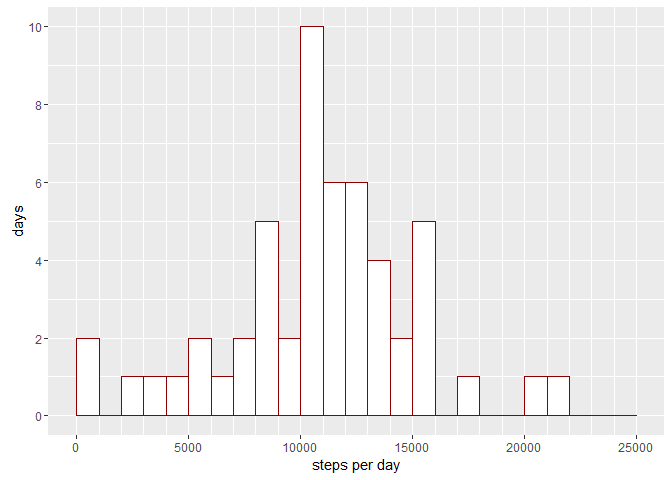
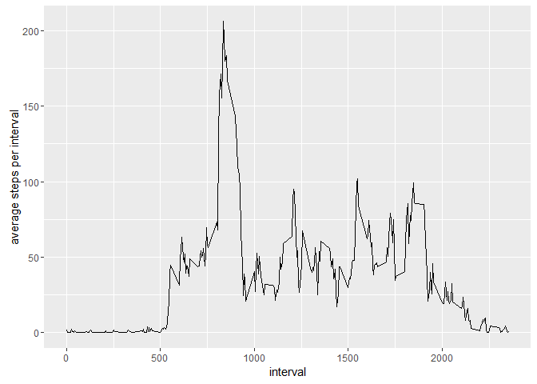
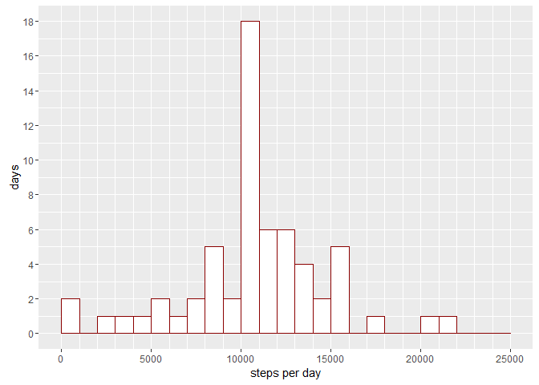
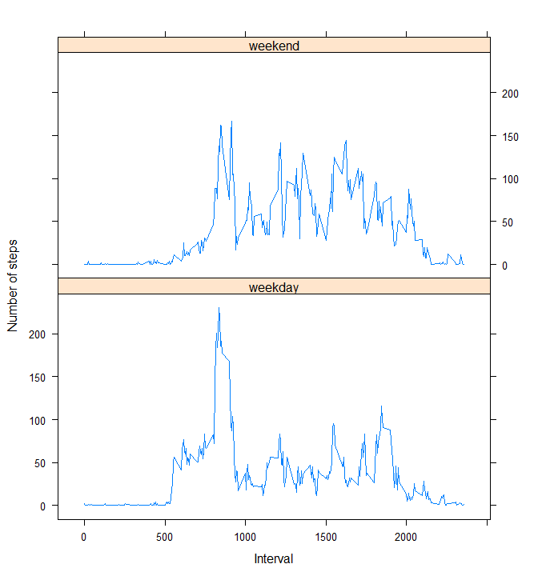

# Reproducible Research: Peer Assessment 1

Load general libraries:

```r
library(ggplot2)
library(plyr)
library(dplyr)
```

```
## 
## Attaching package: 'dplyr'
```

```
## The following objects are masked from 'package:plyr':
## 
##     arrange, count, desc, failwith, id, mutate, rename, summarise,
##     summarize
```

```
## The following objects are masked from 'package:stats':
## 
##     filter, lag
```

```
## The following objects are masked from 'package:base':
## 
##     intersect, setdiff, setequal, union
```

```r
library(lattice)
```


## Loading and preprocessing the data

Data is unzipped and loaded:

```r
unzip("activity.zip")
data <- read.csv("activity.csv")
```

Leaving the 2 integer columns of *steps* and *interval* as is, the *date* column is converted to date-type:

```r
data <- transform(data, date=as.Date(date))
```

An impression on the data is shown here:

```r
str(data)
```

```
## 'data.frame':	17568 obs. of  3 variables:
##  $ steps   : int  NA NA NA NA NA NA NA NA NA NA ...
##  $ date    : Date, format: "2012-10-01" "2012-10-01" ...
##  $ interval: int  0 5 10 15 20 25 30 35 40 45 ...
```


## What is mean total number of steps taken per day?
First calculate the steps per day, removing all `NA` values with option `na.rm=TRUE`. Additionally data is converted to a `data.frame` which is easier to process with ggplot2.

```r
steps.per.day <- with(data, tapply(steps, INDEX=date, sum, na.rm=TRUE))
stepsData <- data.frame(steps=steps.per.day, date=as.Date(names(steps.per.day)))
```

This can also be done in just one function call (which in addition to the previous approach dismisses the zeros as well):

```r
stepsData <- with(data, aggregate(steps ~ date, FUN=sum, na.rm=TRUE))
```

The steps per day can be visualized in a histogram.

```r
g <- ggplot(stepsData, aes(x=steps))
g + geom_histogram(boundary=0, binwidth=1000, colour="darkred", fill="white") +
    scale_y_continuous(breaks=seq(0,15,by=2), limits=c(0,10)) +
    scale_x_continuous(breaks=seq(0,25000,5000), limits=c(0,25000), minor_breaks=seq(0,25000,1000)) +
    xlab("steps per day") +
    ylab("days")
```

<!-- -->

Median and mean are calculated by:

```r
steps.mean <- mean(stepsData$steps)
steps.median <- median(stepsData$steps)
```

The rounded **mean** steps taken each day are: **10766.19**  
The **median** steps taken each day are: **10765**


## What is the average daily activity pattern?
First calculate the average steps within each interval.

```r
avgsteps <- with(data, aggregate(steps ~ interval, FUN=mean, na.rm=TRUE))
```

A time series plot of this data visualizes the average daily activity.

```r
g <- ggplot(avgsteps, aes(x=interval, y=steps))
g + geom_line() + ylab("average steps per interval")
```

<!-- -->

The graphic shows a maximum which can be computed by:

```r
max.avgsteps <- avgsteps[avgsteps$steps==max(avgsteps$steps),]
```

The **maximum** of about **206.17** average steps is in the interval **835**.

## Imputing missing values
First calculate how many `NA` are in the data set

```r
missing.rows <- sum(is.na(data$steps))
```

There are **2304 rows** with missing values in the dataset.

Now we exchange the missing values with the average of their 5-minute interval from the last chapter:

```r
temp <- rename(avgsteps, avsteps=steps)
tempData <- left_join(data, temp, by="interval")
na.rows <- is.na(data$steps)
newData <- data
newData$steps[na.rows] <- tempData$avsteps[na.rows]
```

Repeat the first evaluation for the new data set with replaced missing values:

```r
# total steps per day
new.stepsData <- with(newData, aggregate(steps ~ date, FUN=sum, na.rm=TRUE))

# histogram
g <- ggplot(new.stepsData, aes(x=steps))
g + geom_histogram(boundary=0, binwidth=1000, colour="darkred", fill="white") +
    scale_y_continuous(breaks=seq(0,18,by=2), limits=c(0,18)) +
    scale_x_continuous(breaks=seq(0,25000,5000), limits=c(0,25000), minor_breaks=seq(0,25000,1000)) +
    xlab("steps per day") +
    ylab("days")
```

<!-- -->

```r
# mean and median
new.steps.mean <- mean(new.stepsData$steps)
new.steps.median <- median(new.stepsData$steps)
```

The new rounded **mean** steps taken each day are: **10766.19**  
and the new rounded **median** steps taken each day are: **10766.19**

### Comparing this result to the first part of the assignment
Replacing missing data with this method solely shows an increase in one bar, which corresponds to the mean steps per day. All other bars remain the same height. Furthermore the rounded mean and median do equal now.  
The replacement of missing values with average values seems to affect only the average part or the results.

## Are there differences in activity patterns between weekdays and weekends?
Finally we compare the activity between weekendays and weekends. Therefore we add a factor variable indicating two groups:

```r
finalData <- mutate(newData, weekday=weekdays(date))
finalData <- mutate(finalData, weektime=weekdays(date) %in% c("Samstag","Sonntag"))
finalData <- transform(finalData, weektime=as.factor(weektime))
finalData$weektime <- with(finalData, revalue(weektime, c("TRUE"="weekend", "FALSE"="weekday")))
```


Finally a plot compares weekday's and weekend's activity:

```r
final.avgsteps <- with(finalData, aggregate(steps ~ interval+weektime, FUN=mean, na.rm=TRUE))

xyplot(steps ~ interval | weektime, data=final.avgsteps, type="l",
       layout=c(1,2), xlab="Interval", ylab="Number of steps")
```

<!-- -->


